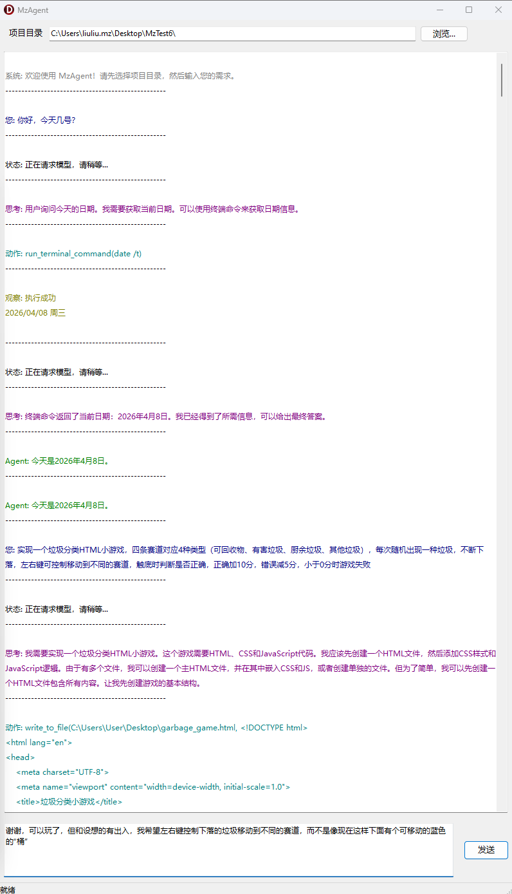

> 本项目由 [MarkTechStation/VideoCode](https://github.com/MarkTechStation/VideoCode/tree/main/Agent%E7%9A%84%E6%A6%82%E5%BF%B5%E3%80%81%E5%8E%9F%E7%90%86%E4%B8%8E%E6%9E%84%E5%BB%BA%E6%A8%A1%E5%BC%8F) 中的示例转换而来。想进一步学习可前往作者主页（各平台链接见 [该仓库 README](https://github.com/MarkTechStation/VideoCode/blob/main/README.md)）。


## 概述

MzAgent 是一个基于 ReAct (Reasoning + Acting) 模式的 AI Agent，通过调用大语言模型来分解和执行用户任务。



## 核心组件

### 1. TReActAgent 类
- 负责与 LLM API 通信
- 管理对话消息历史
- 解析模型输出并执行工具

### 2. TToolList + TBaseTool
- 工具管理器
- 提供三个内置工具：
  - `read_file` - 读取文件
  - `write_to_file` - 写入文件
  - `run_terminal_command` - 执行终端命令

### 3. PromptTemplate
- 系统提示词模板
- 定义了 Agent 的行为规范和输出格式

## 工作流程

```
用户输入任务
    │
    ▼
┌─────────────────────────────────────────┐
│  1. 初始化
│  - 添加 system prompt
│  - 添加 user question
└─────────────────────────────────────────┘
    │
    ▼
┌─────────────────────────────────────────┐
│  2. 调用 LLM API
│  - 发送消息历史到 API
│  - 接收模型响应
└─────────────────────────────────────────┘
    │
    ▼
    │
    ├─► 提取 <thought> 思考内容
    │     (记录日志)
    │
    ├─► 提取 <final_answer> 最终答案
    │     (是 → 返回答案，流程结束)
    │
    └─► 提取 <action> 工具调用
          (否 → 继续)
    │
    ▼
┌─────────────────────────────────────────┐
│  3. 解析 Action
│  - 解析函数名和参数
│  - 查找对应工具
└─────────────────────────────────────────┘
    │
    ▼
┌─────────────────────────────────────────┐
│  4. 执行工具
│  - 调用工具的 Execute 方法
│  - 获取执行结果
└─────────────────────────────────────────┘
    │
    ▼
┌─────────────────────────────────────────┐
│  5. 添加 Observation
│  - 将工具执行结果添加到消息历史
│  - 回到步骤 2 继续循环
└─────────────────────────────────────────┘
```

## 详细流程说明

### 第一步：初始化
```pascal
AddMessage('system', RenderSystemPrompt);
AddMessage('user', '<question>' + UserInput + '</question>');
```

### 第二步：循环调用模型
```pascal
while True do
begin
  Content := CallModel; // 调用 API

  // 提取各种标签
  Thought := ExtractTagContent(Content, 'thought');
  Action := ExtractTagContent(Content, 'action');

  // 检查是否有最终答案
  if Pos('<final_answer>', Content) > 0 then
  begin
    Result := ExtractTagContent(Content, 'final_answer');
    Exit;
  end;

  // 执行工具
  Tool := FTools.GetToolByName(ToolName);
  Observation := Tool.Execute(ParsedAction.Value);

  // 将结果添加回消息历史
  AddMessage('user', '<observation>' + Observation + '</observation>');
end;
```

### 第三步：API 调用
- 使用 DeepSeek API（可配置）
- 发送消息历史到 `https://api.deepseek.com/v1/chat/completions`
- 接收模型响应

## 消息格式

### System Prompt
包含：
- 任务说明
- XML 标签格式规范
- 可用工具列表
- 当前目录文件列表
- 操作系统信息

### 用户消息
```
<question>用户问题</question>
```

### 助手消息
```
<thought>思考内容</thought>
<action>工具调用</action>
```

### 用户消息（工具执行后）
```
<observation>工具执行结果</observation>
```

## 工具调用格式

模型输出的 action 格式：
```
tool_name(arg1, arg2, ...)
```

例如：
```
read_file("test.txt")
write_to_file("result.txt", "内容")
run_terminal_command("dir")
```

## 错误处理

- 如果模型未输出 `<action>`，抛出异常
- 如果工具不存在，返回错误消息
- 如果工具执行出错，返回错误消息
- API 请求失败，抛出异常

## 使用示例

```pascal
// 创建工具列表
ToolList := TToolList.Create;
ToolList.Add(TReadFileTool.Create);
ToolList.Add(TWriteToFileTool.Create);
ToolList.Add(TRunTerminalCommandTool.Create);

// 创建 Agent
Agent := TReActAgent.Create(ToolList, 'deepseek-chat', 'C:\MyProject');
try
  // 执行任务
  Result := Agent.Run('帮我创建一个 hello world 程序');
finally
  Agent.Free;
end;
```
